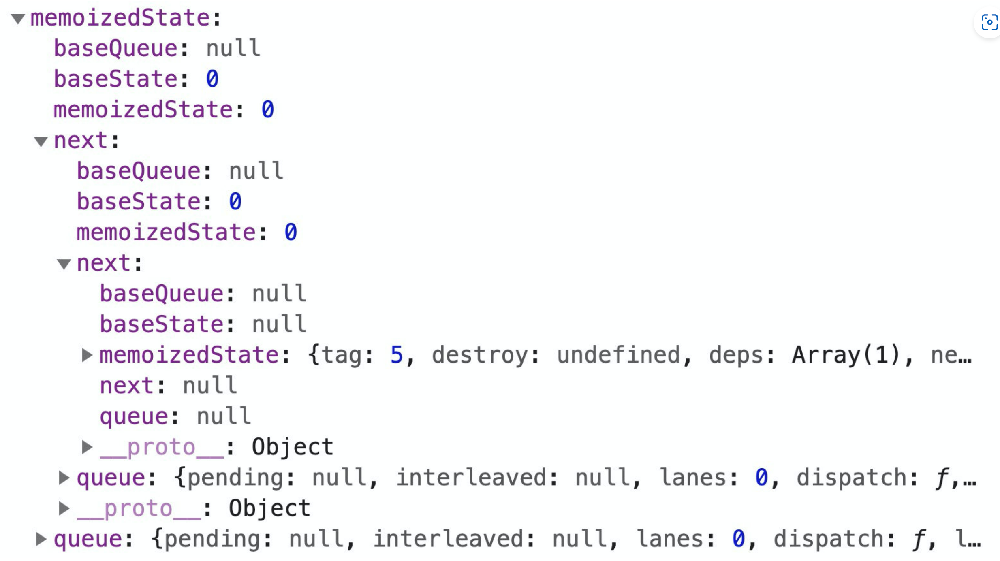
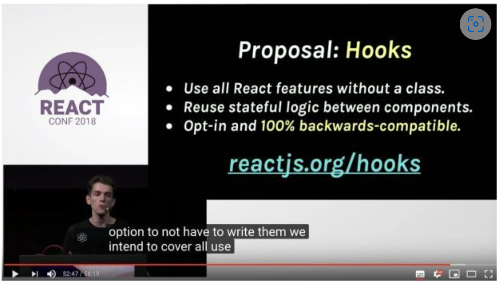
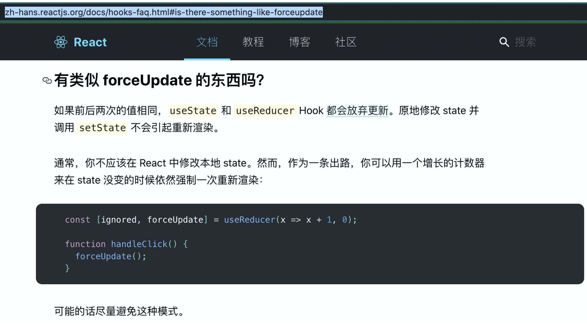

# 那些我回答了800遍的问题

## [文档与代码地址](https://gitee.com/bubucuo/DebugReact)

## [b站视频讲解地址](https://www.bilibili.com/video/BV1rK411F7x3?share_source=copy_web)


### 新手如何学习React


### React学习资料推荐

1. react: https://react.docschina.org/

2. redux: https://redux.js.org/

3. react-router: http://react-router.docschina.org/

4. umi3: https://umijs.org/zh-CN/docs
5. dva: https://dvajs.com/
6. antd ui组件库: https://ant.design/index-cn
7. mobx: https://mobx.js.org/about-this-documentation.html 中文: https://zh.mobx.js.org/README.html
8. mobx-react: https://zh.mobx.js.org/react-integration.html


### React知识图谱

https://www.processon.com/view/link/600f92d7079129045d3855ed


## Todo 如何调试源码

https://gitee.com/bubucuo/DebugReact


### class组件中，事件中this为什么是undefined

标准函数中，this引用的是把函数当成方法调用的上下文对象，在网页的全局上下文调用函数时，this指向window。(红宝书Page300)

箭头函数中，this引用的是定义箭头函数的上下文。

bind方法会创建一个新的函数实例，其this值会被绑定到传给bind()的对象。

apply和call都会以指定的this来调用函数。

源码解析：


示例：

```js
import {Component} from "react";

export default class AboutThisPage extends Component {
  constructor(props) {
    super(props);
    this.state = {count: 0};
    // this.handle = this.handle.bind(this);
  }

  handleOfArrow = (arg) => {
    console.log("箭头函数 this", this); //sy-log
    this.setState({count: this.state.count + 1});
  };

  handle() {
    console.log("标准函数 this", this); //sy-log
  }

  render() {
    return (
      <div>
        <h3>AboutThisPage</h3>
        <p>{this.state.count}</p>
        <button onClick={this.handleOfArrow}>箭头函数</button>
        <button onClick={(...arg) => this.handle(arg)}>标准函数</button>
      </div>
    );
  }
}
```


### React类组件中的constructor中为什么一定要使用super

1. 首先，先明确super不是React的知识点，而是es6的。（js红宝书P260）

2. 在这里super作为函数调用，代表父类的构造函数。es6规定，子类的构造函数必须执行一次super函数，否则会报错。

   ```js
   const Context = React.createContext();
   
   class ClassComponent extends React.Component {
     static contextType = Context;
     constructor(props, context) {
       super();
       this.state = {};
       console.log("this", this); //sy-log
     }
     render() {
       return <div className="class border">{this.props.name}</div>;
     }
   }
   
   function FunctionComponent({name}) {
     return (
       <div className="function border">
         <p>{name}</p>
         <button onClick={() => console.log("omg")}>click</button>
       </div>
     );
   }
   
   const jsx = (
       <Context.Provider value={{omg: 123}}>
         <ClassComponent name="class组件" />
       </Context.Provider>
   );
   
   export default jsx;
   ```

3. super只能在派生类构造函数和静态方法中使用，不能在调用super之前引用this。

4. 如果没有定义类构造函数，在实例化派生类时会调用super，而且会传入所有传给派生类的参数。

补充：super也可以作为对象使用，但是不能单独使用。


### Hook为什么只能用在React函数的最顶层（详细解释Hook规则）

React规则：https://react.docschina.org/docs/hooks-rules.html#only-call-hooks-at-the-top-level


hooks是作为一个单链表存储在fiber.memoizedState上的，因为这些hook没有名字，所以为了区分它们，我们必须保证这个链表节点顺序的稳定性。



测试代码如下:

```jsx
import {useState, useReducer, useEffect} from "react";

function FunctionComponent() {
  const [count, setCount] = useState(0);
  const [count2, dispatch] = useReducer((x) => x + 1, 0);

  useEffect(() => {
    console.log("count"); //sy-log
  }, [count]);

  return (
    <div className="function border">
      <button onClick={() => setCount(count + 1)}>{count}</button>
      <button onClick={() => dispatch()}>{count2}</button>
    </div>
  );
}

const jsx = <FunctionComponent />;

export default jsx;
```


### useState与useReducer为什么返回一个数组，而不是一个对象

为了用户自定义值。如果源码中返回的是个对象，那么状态值和修改状态值的函数名字都写死了，不方便用户多处使用。

```js
import {useState, useReducer, useEffect} from "react";

function FunctionComponent() {
  const [count, setCount] = useState(0);
  return (
    <div className="function border">
      <button onClick={() => setCount(count + 1)}>{count}</button>
    </div>
  );
}

const jsx = <FunctionComponent />;

export default jsx;
```


### 函数组件中的setState没有回调函数怎么办

可以使用useEffect或者useLayoutEffect。

```js
import * as React from "react";

class ClassComponent extends React.Component {
  constructor(props) {
    super(props);
    this.state = {count: 0};
  }

  handle = () => {
    const {count} = this.state;
    this.setState({count: count + 1}, function(state, props) {
      console.log("a", state, props); //sy-log
    });
  };
  render() {
    const {count} = this.state;

    return (
      <div className="class border">
        {this.props.name}
        <button onClick={this.handle}>{count}</button>
      </div>
    );
  }
}

function FunctionComponent({name}) {
  const [count, setCount] = React.useState(0);
  React.useEffect(() => {
    console.log("useEffect count", count); //sy-log
  }, [count]);
  React.useLayoutEffect(() => {
    console.log("useLayoutEffect count", count); //sy-log
  }, [count]);

  return (
    <div className="function border">
      {name}
      <button onClick={() => setCount(count + 1)}>{count}</button>
    </div>
  );
}

const jsx = (
  <div className="box border">
    <FunctionComponent name="函数组件" />
    <ClassComponent name="class组件" />
  </div>
);

export default jsx;
```


### 什么是Hook



*Hook* 是 React 16.8 的新增特性。它可以让你在不编写 class 的情况下使用 state 以及其他的 React 特性。

Hook 为已知的 React 概念提供了更直接的 API：props， state，context，refs 以及生命周期。

**没有计划从 React 中移除 class。**

React内置的Hook API：

- [基础 Hook](https://react.docschina.org/docs/hooks-reference.html#basic-hooks)
  - [`useState`](https://react.docschina.org/docs/hooks-reference.html#usestate)
  - [`useEffect`](https://react.docschina.org/docs/hooks-reference.html#useeffect)
  - [`useContext`](https://react.docschina.org/docs/hooks-reference.html#usecontext)
- [额外的 Hook](https://react.docschina.org/docs/hooks-reference.html#additional-hooks)
  - [`useReducer`](https://react.docschina.org/docs/hooks-reference.html#usereducer)
  - [`useCallback`](https://react.docschina.org/docs/hooks-reference.html#usecallback)
  - [`useMemo`](https://react.docschina.org/docs/hooks-reference.html#usememo)
  - [`useRef`](https://react.docschina.org/docs/hooks-reference.html#useref)
  - [`useImperativeHandle`](https://react.docschina.org/docs/hooks-reference.html#useimperativehandle)
  - [`useLayoutEffect`](https://react.docschina.org/docs/hooks-reference.html#uselayouteffect)
  - [`useDebugValue`](https://react.docschina.org/docs/hooks-reference.html#usedebugvalue)

```jsx
import React, { useState } from 'react';

function Example() {
  // 声明一个新的叫做 “count” 的 state 变量
  const [count, setCount] = useState(0);  
 
  return (
    <div>
      <p>You clicked {count} times</p>
      <button onClick={() => setCount(count + 1)}>
        Click me
      </button>
    </div>
  );
}
```


#### 没有破坏性改动

在我们继续之前，请记住 Hook 是：

- **完全可选的。** 你无需重写任何已有代码就可以在一些组件中尝试 Hook。但是如果你不想，你不必现在就去学习或使用 Hook。
- **100% 向后兼容的。** Hook 不包含任何破坏性改动。
- **现在可用。** Hook 已发布于 v16.8.0。

**没有计划从 React 中移除 class。** 


### Hook解决了什么问题（Hook带来的好处） 

[原文地址](https://react.docschina.org/docs/hooks-intro.html)

Hook 解决了我们那些年来编写和维护成千上万的组件时遇到的各种各样看起来不相关的问题。无论你正在学习 React，或每天使用，或者更愿尝试另一个和 React 有相似组件模型的框架，你都可能对这些问题似曾相识。

#### 在组件之间复用状态逻辑很难

React 没有提供将可复用性行为“附加”到组件的途径（例如，把组件连接到 store）。如果你使用过 React 一段时间，你也许会熟悉一些解决此类问题的方案，比如 [render props](https://zh-hans.reactjs.org/docs/render-props.html) 和 [高阶组件](https://zh-hans.reactjs.org/docs/higher-order-components.html)。但是这类方案需要重新组织你的组件结构，这可能会很麻烦，使你的代码难以理解。如果你在 React DevTools 中观察过 React 应用，你会发现由 providers，consumers，高阶组件，render props 等其他抽象层组成的组件会形成“嵌套地狱”。尽管我们可以[在 DevTools 过滤掉它们](https://github.com/facebook/react-devtools/pull/503)，但这说明了一个更深层次的问题：React 需要为共享状态逻辑提供更好的原生途径。

你可以使用 Hook 从组件中提取状态逻辑，使得这些逻辑可以单独测试并复用。**Hook 使你在无需修改组件结构的情况下复用状态逻辑。** 这使得在组件间或社区内共享 Hook 变得更便捷。

具体将在[自定义 Hook](https://zh-hans.reactjs.org/docs/hooks-custom.html) 中对此展开更多讨论。


#### 复杂组件变得难以理解

我们经常维护一些组件，组件起初很简单，但是逐渐会被状态逻辑和副作用充斥。每个生命周期常常包含一些不相关的逻辑。例如，组件常常在 `componentDidMount` 和 `componentDidUpdate` 中获取数据。但是，同一个 `componentDidMount` 中可能也包含很多其它的逻辑，如设置事件监听，而之后需在 `componentWillUnmount` 中清除。相互关联且需要对照修改的代码被进行了拆分，而完全不相关的代码却在同一个方法中组合在一起。如此很容易产生 bug，并且导致逻辑不一致。

在多数情况下，不可能将组件拆分为更小的粒度，因为状态逻辑无处不在。这也给测试带来了一定挑战。同时，这也是很多人将 React 与状态管理库结合使用的原因之一。但是，这往往会引入了很多抽象概念，需要你在不同的文件之间来回切换，使得复用变得更加困难。

为了解决这个问题，**Hook 将组件中相互关联的部分拆分成更小的函数（比如设置订阅或请求数据）**，而并非强制按照生命周期划分。你还可以使用 reducer 来管理组件的内部状态，使其更加可预测。

我们将在[使用 Effect Hook](https://zh-hans.reactjs.org/docs/hooks-effect.html#tip-use-multiple-effects-to-separate-concerns) 中对此展开更多讨论。


#### 难以理解的 class

除了代码复用和代码管理会遇到困难外，我们还发现 class 是学习 React 的一大屏障。你必须去理解 JavaScript 中 `this` 的工作方式，这与其他语言存在巨大差异。还不能忘记绑定事件处理器。没有稳定的[语法提案](https://babeljs.io/docs/en/babel-plugin-transform-class-properties/)，这些代码非常冗余。大家可以很好地理解 props，state 和自顶向下的数据流，但对 class 却一筹莫展。即便在有经验的 React 开发者之间，对于函数组件与 class 组件的差异也存在分歧，甚至还要区分两种组件的使用场景。

另外，React 已经发布五年了，我们希望它能在下一个五年也与时俱进。就像 [Svelte](https://svelte.dev/)，[Angular](https://angular.io/)，[Glimmer](https://glimmerjs.com/)等其它的库展示的那样，组件[预编译](https://en.wikipedia.org/wiki/Ahead-of-time_compilation)会带来巨大的潜力。尤其是在它不局限于模板的时候。最近，我们一直在使用 [Prepack](https://prepack.io/) 来试验 [component folding](https://github.com/facebook/react/issues/7323)，也取得了初步成效。但是我们发现使用 class 组件会无意中鼓励开发者使用一些让优化措施无效的方案。class 也给目前的工具带来了一些问题。例如，class 不能很好的压缩，并且会使热重载出现不稳定的情况。因此，我们想提供一个使代码更易于优化的 API。

为了解决这些问题，**Hook 使你在非 class 的情况下可以使用更多的 React 特性。** 从概念上讲，React 组件一直更像是函数。而 Hook 则拥抱了函数，同时也没有牺牲 React 的精神原则。Hook 提供了问题的解决方案，无需学习复杂的函数式或响应式编程技术。


### 函数组件与类组件如何选择

函数组件和类组件都可以取代对方。可以参考以下规则选择：

#### 颗粒度

函数组件颗粒度更小，是函数式编程的优先选择。

颗粒度体现在state定义与useEffect、useLayoutEffect上，函数组件可以写多个，也可以拆成自定义hook调用。但是相比之下，类组件 的state和每个生命周期函数在组件中都最多能用一次，拆到组件外也比较繁琐。

#### 实例

类组件有实例，如果需要用到实例的话，类组件是首选。

#### 复用状态逻辑

函数组件和类组件都可以复用状态逻辑。

类组件可以通过hoc、render props，但是容易形成嵌套地狱，参考antd3 form的createForm和react-redux的connect一起用在一个组件里的时候，四层括号，闹心~。但是函数组件用一个自定义hook就完事了，你看antd4 form的useForm。

#### 学习成本

类组件有个this，合成事件中可能会比较难以理解，但是函数组件并没有这种设计，上手简单~

#### 其他

具体API

#### 总结

函数编程挺火的，但是都得学，掌握原理才是正道~


### 函数组件当中如何实现forceUpdate

官网地址：https://zh-hans.reactjs.org/docs/hooks-faq.html#is-there-something-like-forceupdate




如下源码中判断如果useState和useReducer前后两次值相等，则放弃更新。


如下三种使用forceUpdate的方法：useReducer、useState或者useForceUpdate，

```js
import {useCallback, useReducer, useState} from "react";

export default function FunctionComponentForceUpdate(props) {
  console.log("omg"); //sy-log

  // const [count, forceUpdate] = useState(0);
  // ! 方法1
  // const [, forceUpdate] = useReducer((x) => x + 1, 0);

  // ! 方法2
  const forceUpdate = useForceUpdate();

  const handleClick = () => {
    // forceUpdate(count + 1);
    // forceUpdate((prev) => prev + 1);
    forceUpdate();
  };

  return (
    <div>
      <h3>FunctionComponentForceUpdate</h3>
      <button onClick={handleClick}>count</button>
    </div>
  );
}

function useForceUpdate() {
  const [state, setState] = useState(0);
  // const [, setState] = useReducer((x) => x + 1, 0);

  const update = useCallback(() => {
    setState((prev) => prev + 1);
    // setState();
  }, []);

  return update;
}
```


### 什么是合成事件

React为了 实现跨平台兼容性，对于事件处理有自己的一套代码。

React中有自己的事件系统模式，即通常被称为**React合成事件**。之所以采用这种自己定义的合成事件，一方面是为了抹平差异性，使得React开发者不需要自己再去关注浏览器事件兼容性问题，另一方面是为了统一管理事件，提高性能，这主要体现在React内部实现事件委托，并且记录当前事件发生的状态上。

事件委托，也就是我们通常提到的事件代理机制，这种机制不会把时间处理函数直接绑定在真实的节点上，而是把所有的事件绑定到结构的最外层，使用一个统一的事件监听和处理函数。当组件加载或卸载时，只是在这个统一的事件监听器上插入或删除一些对象；当事件放生时，首先被这个统一的事件监听器处理，然后在映射表里找到真正的事件处理函数并调用。这样做简化了事件处理和回收机制，效率也有很大提升。

记录当前事件发生的状态，即记录事件执行的上下文，这便于React来处理不同事件的优先级，达到谁优先级高先处理谁的目的，这里也就实现了React的增量渲染思想，可以预防掉帧，同时达到页面更顺滑的目的，提升用户体验。


### fiber是什么


### 虚拟dom是什么

### setState的同步与异步

### 

### React中的状态管理

### React中的数据通信方式

### React中的生命周期变更原因

### React中的数据通信

### 

### 

### hooks API用法


### 尾调用优化